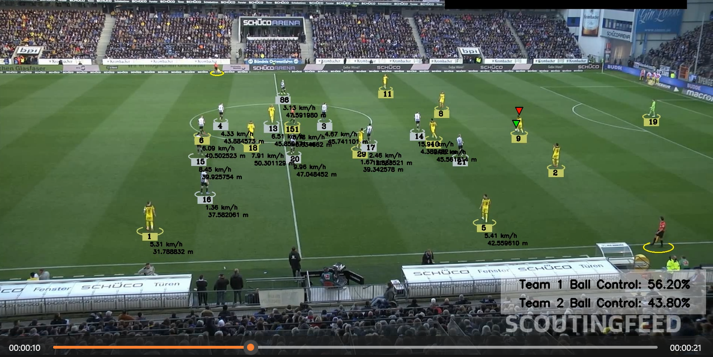

# ⚽ Football Analytics System using YOLOv8, Computer Vision and Machine Learning



---

## 📌 Overview

This project builds a complete **Football Analytics System** using **Computer Vision, Machine Learning, and Deep Learning**.

The system detects, tracks, and analyzes players, referees, goalkeepers, and the ball from a football video. It calculates real-world performance metrics such as:

- Player Speed (km/h)
- Distance Covered (meters)
- Team Assignment based on jersey color
- Ball Possession per player and team

This project solves a real-world sports analytics problem and demonstrates production-level AI engineering skills.

---

## 🚀 Features

- ⚽ Ball Detection using custom-trained YOLOv8
- 🧍 Player Detection and Tracking
- 👨‍⚖️ Referee Detection
- 🎯 Multi-object tracking using ByteTrack
- 🎨 Team Assignment using KMeans clustering
- 📷 Camera Motion Estimation using Optical Flow
- 📐 Perspective Transformation (Pixel → Meter conversion)
- 🏃 Speed Calculation (km/h)
- 📏 Distance Measurement (meters)
- 📊 Team Ball Possession Statistics
- 🎥 Annotated Output Video Generation

---

## 🧠 Technologies Used

- Python
- YOLOv8 (Ultralytics)
- OpenCV
- NumPy
- Supervision (ByteTrack)
- Scikit-learn (KMeans)
- Optical Flow
- Perspective Transformation
- Computer Vision
- Deep Learning

---

## 🏗️ System Pipeline

The processing pipeline works as follows:

1. Input football video
2. Detect objects using YOLOv8
3. Track objects across frames using ByteTrack
4. Estimate camera movement using Optical Flow
5. Apply perspective transformation
6. Assign players to teams using KMeans clustering
7. Assign ball possession to nearest player
8. Calculate speed and distance covered
9. Generate annotated output video

---

## 📂 Project Structure

```
football_analytics/
│
├── input_videos/
│ └── input_video.mp4
│
├── output_videos/
│ └── output_video.avi
│
├── models/
│ └── best.pt
│
├── trackers/
│ └── tracker.py
│
├── team_assigner/
│ └── team_assigner.py
│
├── player_ball_assigner/
│ └── player_ball_assigner.py
│
├── camera_movement_estimator/
│ └── camera_movement_estimator.py
│
├── speed_and_distance_estimator/
│ └── speed_and_distance_estimator.py
│
├── utils/
│
├── stubs/
│
├── assets/
│ └── demo.png
│
├── main.py
├── yolov8s.pt
└── README.md
```

---

## ▶️ Installation

### 1. Clone the repository

```bash
git clone https://github.com/MiloudiAhmed/football_analytics.git
cd football_analytics
```
### 2. Install dependencies
```bash
pip install -r requirements.txt
```

#### If requirements.txt does not exist, install manually:

```bash
pip install ultralytics opencv-python numpy supervision scikit-learn pandas
```

## ▶️ Run the Project

```bash
python main.py
```

### Output will be generated in:

output_videos/output_video.avi

## 🧪 Train Your Own YOLOv8 Model

### You can improve detection accuracy by training on your own dataset:

```bash
yolo task=detect mode=train model=yolov8s.pt data=data.yaml epochs=100 imgsz=960
```

### After training, copy:

runs/detect/train/weights/best.pt


### to:

models/best.pt

## 📊 Output Example

### The output video includes:

- Player tracking IDs

- Team colors

- Ball possession indicator

- Player speed (km/h)

- Distance covered (meters)

- Team ball possession percentage

## 🧠 Concepts Covered

### This project demonstrates advanced concepts including:

- Object Detection

- Object Tracking

- Deep Learning

- Computer Vision

- Optical Flow

- Perspective Geometry

- Clustering (KMeans)

- Sports Analytics

- Real-world AI system design

## 🎯 Applications

### This system can be used for:

- Football match analysis

- Player performance analysis

- Tactical analysis

- Sports analytics platforms

- AI sports startups

## 🔮 Future Improvements

- Real-time processing

- Player heatmaps

- Pass detection

- Tactical analysis

- Automatic highlight generation

## 👨‍💻 Author

### Ahmed Miloudi

#### Master Student in Artificial Intelligence & Data Science
#### Passionate about Computer Vision, AI, and Football Analytics

## ⭐ Support

### If you like this project, please give it a star ⭐ on GitHub.
